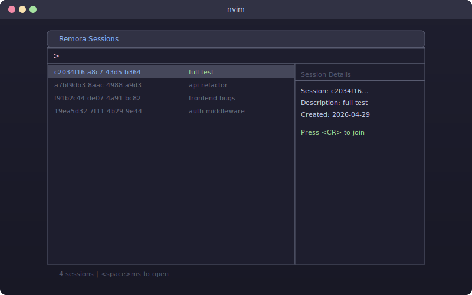
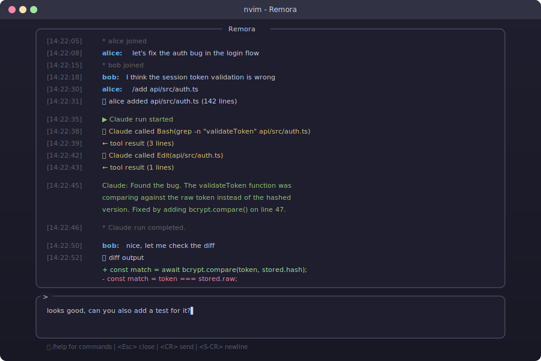
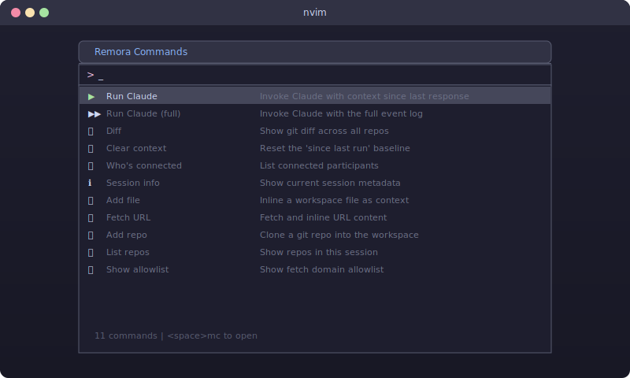
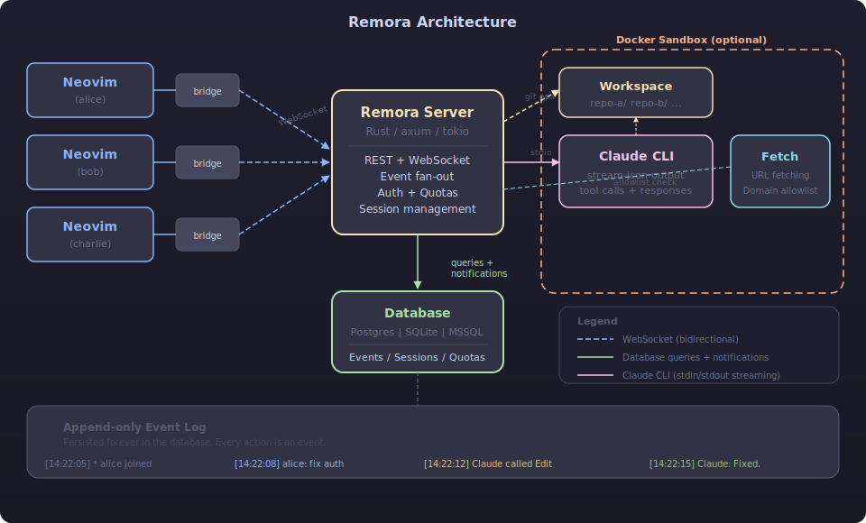

# Remora

Collaborative Claude Code sessions. Multiple devs share a single session with a shared, append-only event log. Chat freely, add context, and invoke Claude together.

## Screenshots

### Session Picker (`<space>ms`)
Browse and join sessions with Telescope.



### Shared Chat Window
Real-time event log with syntax highlighting. Everyone sees chat, tool calls, and Claude's responses as they happen.



### Command Picker (`<space>mc`)
Fuzzy-searchable command palette for all Remora actions.



## How It Works

1. **Create a session** -- one dev creates a session (optionally with git repos cloned in)
2. **Everyone joins** -- teammates connect by session ID via the Telescope picker
3. **Chat and add context** -- send messages, inline files (`/add`), fetch URLs (`/fetch`), view diffs (`/diff`)
4. **Invoke Claude** -- anyone types `/run` and Claude sees all context since the last response
5. **Watch Claude work** -- tool calls, file edits, and responses stream to everyone in real-time
6. **Iterate** -- keep chatting, adding context, and running Claude as a team

Everything is persisted in the database. Reconnect anytime and get the full history. The plugin auto-reconnects up to 3 times on unexpected disconnects.

## Architecture



- **Neovim Plugin** -- Lua plugin with Telescope integration. Communicates via a small Rust bridge binary over WebSocket.
- **Server** -- Rust (axum). Handles auth, WebSocket connections, event fan-out. Stateless across restarts.
- **Database** -- Postgres (default), SQLite, or MSSQL. Append-only event log, session metadata, allowlists, quotas.
- **Claude CLI** -- Invoked on the server host. Streams output as events. Configurable whether permissions are skipped.

## Important Notes

- **Security**: By default, Claude runs with `--dangerously-skip-permissions` on the server host. Set `REMORA_SKIP_PERMISSIONS=false` to disable this. The Docker sandbox feature (`REMORA_USE_SANDBOX=true`) provides isolation but is not enabled by default.
- **One run at a time**: Only one Claude run per session. Additional `/run` requests are queued/rejected while one is in flight.
- **Max turns**: Claude runs are capped at 5 agentic turns per invocation (hardcoded).
- **Fetch limits**: `/fetch` truncates responses at 100KB.
- **Idle cleanup**: Sessions idle longer than `REMORA_IDLE_TIMEOUT_SECS` have their workspace deleted. Event history is retained in the database.

## Prerequisites

- **Rust** 1.75+ (edition 2021)
- **Database**: Postgres 15+, SQLite 3.35+, or MSSQL 2019+
- **Claude CLI**: installed and authenticated on the server (`npm install -g @anthropic-ai/claude-code && claude login`)
- **git**: on the server (for `/repo add`)
- **curl**: on the client (the Neovim plugin uses it for REST calls)
- **Neovim** 0.9+ with [telescope.nvim](https://github.com/nvim-telescope/telescope.nvim) and [plenary.nvim](https://github.com/nvim-lua/plenary.nvim)

## Setup

### 1. Server

```bash
# -- Postgres setup (skip for SQLite) --
sudo -u postgres psql -c "CREATE USER remora WITH PASSWORD 'your-password';"
sudo -u postgres psql -c "CREATE DATABASE remora OWNER remora;"
sudo -u postgres psql -d remora -c "CREATE EXTENSION IF NOT EXISTS \"uuid-ossp\";"
sudo -u postgres psql -d remora -c "GRANT ALL ON SCHEMA public TO remora;"

# -- Configure --
cp .env.example .env
# Edit .env — at minimum set DATABASE_URL and REMORA_TEAM_TOKEN

# -- Build and run --
cargo build --release -p remora-server
source .env && ./target/release/remora-server
# Tables are created automatically on first run via migrations.
```

For **SQLite**, set `REMORA_DB_PROVIDER=sqlite` and `DATABASE_URL=sqlite:remora.db` (or `:memory:` for testing).

#### Server environment variables

| Variable | Default | Description |
|---|---|---|
| `DATABASE_URL` | *required* | Connection string (`postgres://...`, `sqlite:file.db`, or MSSQL) |
| `REMORA_TEAM_TOKEN` | *required* | Shared secret for auth |
| `REMORA_DB_PROVIDER` | `postgres` | Database backend: `postgres`, `sqlite`, or `mssql` |
| `REMORA_BIND` | `0.0.0.0:7200` | Listen address |
| `REMORA_WORKSPACE_DIR` | `/var/lib/remora/workspaces` | Where session repos are cloned |
| `REMORA_RUN_TIMEOUT_SECS` | `600` | Max wall-clock time per Claude run |
| `REMORA_IDLE_TIMEOUT_SECS` | `1800` | Cleanup idle sessions after this many seconds |
| `REMORA_GLOBAL_DAILY_CAP` | `10000000` | Global daily token limit across all sessions |
| `REMORA_CLAUDE_CMD` | `claude` | Path to Claude CLI binary |
| `REMORA_SKIP_PERMISSIONS` | `true` | Pass `--dangerously-skip-permissions` to Claude |
| `REMORA_USE_SANDBOX` | `false` | Run Claude inside a Docker container per session |
| `REMORA_DOCKER_IMAGE` | `ubuntu:22.04` | Docker image for sandbox containers |

### 2. Client (Neovim)

Build the bridge binary for your platform:

```bash
cargo build --release -p remora-bridge
```

Add to your Neovim config (lazy.nvim):

```lua
{
  "Logan-Garrett/remora",
  dependencies = {
    "nvim-telescope/telescope.nvim",
    "nvim-lua/plenary.nvim",
  },
  config = function()
    require("remora").setup({
      bridge = vim.fn.expand("path/to/remora-bridge"),
      -- These fall back to env vars: REMORA_URL, REMORA_TEAM_TOKEN, REMORA_NAME
      url = "http://your-server:7200",
      token = "your-team-token",
      name = "yourname",
    })
    require("telescope").load_extension("remora")
  end,
}
```

#### Plugin setup options

| Option | Default | Description |
|---|---|---|
| `bridge` | `"remora-bridge"` | Path to the bridge binary |
| `url` | `"http://localhost:7200"` | Server URL |
| `token` | `""` | Team token (or set `REMORA_TEAM_TOKEN` env var) |
| `name` | `vim.fn.hostname()` | Your display name |

### 3. Cross-compile for ARM Linux (Raspberry Pi, etc.)

```bash
rustup target add aarch64-unknown-linux-gnu
cargo install cargo-zigbuild
cargo zigbuild --release --target aarch64-unknown-linux-gnu -p remora-server
scp target/aarch64-unknown-linux-gnu/release/remora-server user@host:~/remora/
```

## Usage

### Suggested keybindings

The plugin registers commands but not keybindings. Add these to your config:

```lua
vim.keymap.set("n", "<leader>mm", function() require("remora").toggle() end, { desc = "Toggle Remora" })
vim.keymap.set("n", "<leader>ms", "<CMD>Telescope remora sessions<CR>", { desc = "Browse sessions" })
vim.keymap.set("n", "<leader>mc", "<CMD>Telescope remora commands<CR>", { desc = "Remora commands" })
vim.keymap.set("n", "<leader>mn", "<CMD>Telescope remora new<CR>", { desc = "New session" })
vim.keymap.set("n", "<leader>mr", function() require("remora").send_command("/run") end, { desc = "Run Claude" })
vim.keymap.set("n", "<leader>ml", "<CMD>RemoraLeave<CR>", { desc = "Leave session" })
```

### Prompt buffer controls

| Key | Action |
|---|---|
| `<CR>` | Send message (or execute slash command) |
| `<S-CR>` or `<C-j>` | Insert newline |
| `<Esc>` / `q` | Close the Remora window (stays connected) |
| `G` (in log) | Re-enable auto-scroll after scrolling up |

### Slash commands (type in the prompt buffer)

| Command | Description |
|---|---|
| `/run` | Invoke Claude with context since last response |
| `/run-all` | Invoke Claude with the full event log |
| `/clear` | Reset context baseline |
| `/diff` | Git diff across all repos |
| `/add <path>` | Inline a file as context |
| `/fetch <url>` | Fetch and inline URL content |
| `/who` | List connected participants |
| `/session info` | Current session metadata |
| `/session new <url> "<desc>"` | Create a new session |
| `/repo list` | List repos in session |
| `/repo add <url>` | Clone a repo into the workspace |
| `/repo remove <name>` | Remove a repo |
| `/allowlist` | Show fetch domain allowlist |
| `/allowlist add <domain>` | Pre-approve a domain |
| `/allowlist remove <domain>` | Remove a domain from allowlist |
| `/approve <domain>` | Approve a pending fetch |
| `/deny <domain>` | Deny a pending fetch |
| `/kick <name>` | Remove a participant |
| `/join <id>` | Switch to another session |
| `/sessions` | List all sessions |
| `/help` | Show command list |

### REST API

| Method | Path | Description |
|---|---|---|
| `POST` | `/sessions` | Create session `{description, repos: [url]}` |
| `GET` | `/sessions` | List sessions |
| `DELETE` | `/sessions/:id` | Delete session + cleanup |
| `GET` | `/sessions/:id` | WebSocket upgrade (query: `token`, `name`) |

All endpoints require `Authorization: Bearer <token>` header (or `token` query param for WS).

## Database Support

| Backend | Provider value | Notifications | Notes |
|---|---|---|---|
| Postgres | `postgres` | LISTEN/NOTIFY | Recommended for multi-instance deployments |
| SQLite | `sqlite` | In-process broadcast | Single instance only, great for local dev |
| MSSQL | `mssql` | In-process broadcast | Requires `--features mssql` at build time |

## Contributing

PRs are welcome. Some areas that could use help:

- **Better streaming** -- token-level streaming instead of per-turn
- **IDE plugins** -- VS Code, JetBrains, or other editors
- **Web client** -- browser-based alternative to the Neovim plugin
- **OAuth/JWT auth** -- replace the shared team token with proper user accounts
- **Session persistence** -- export workspace state, push branches before cleanup
- **Network proxy** -- egress proxy for sandbox containers to enforce fetch allowlists

Fork, branch, PR. No special process -- just keep it clean and explain what you changed.

## License

MIT
