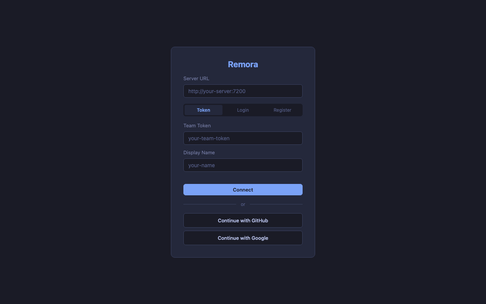
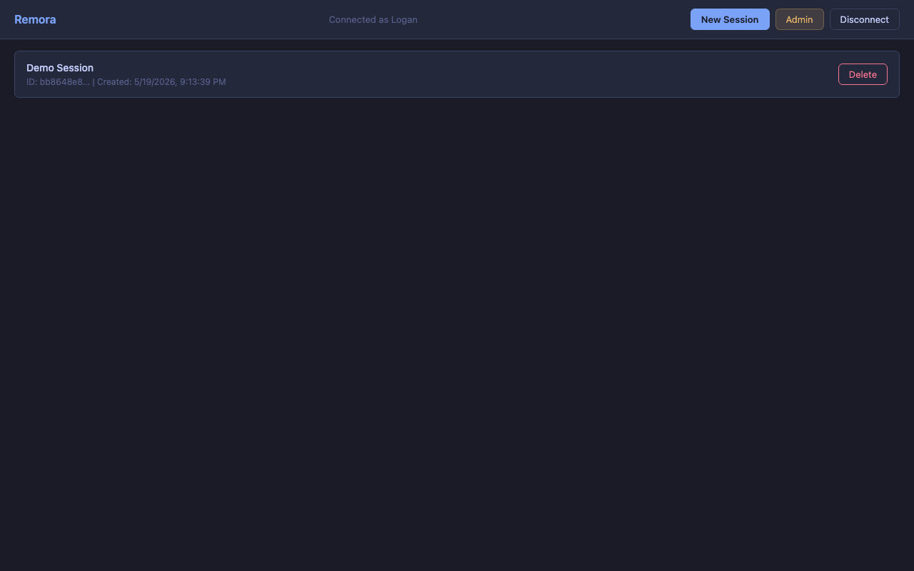
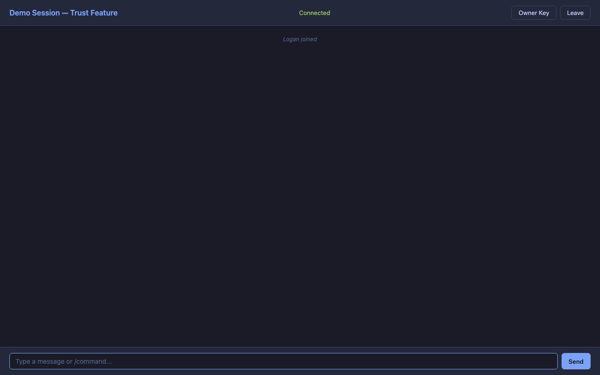
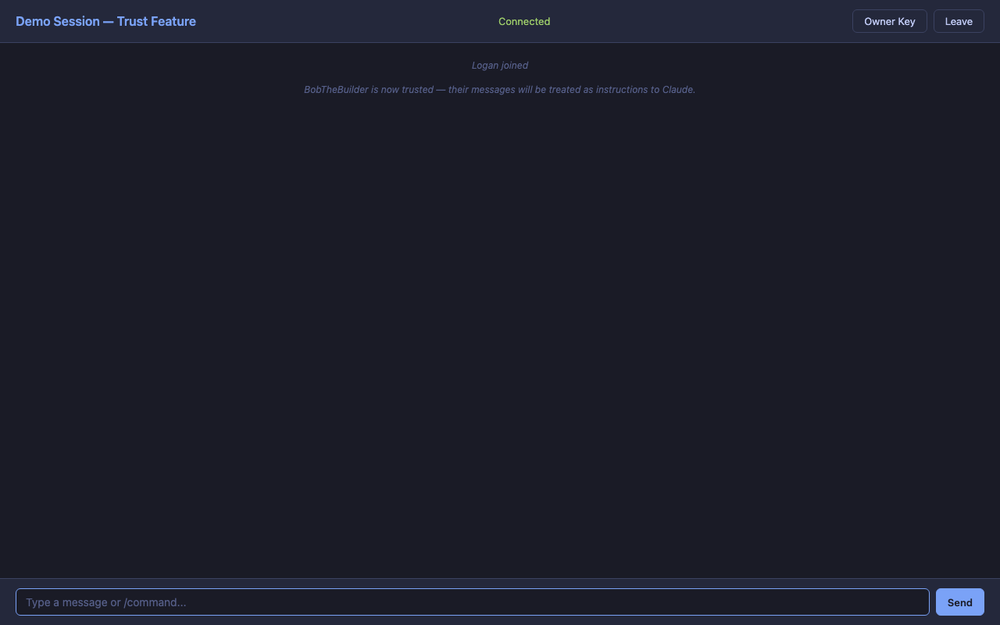
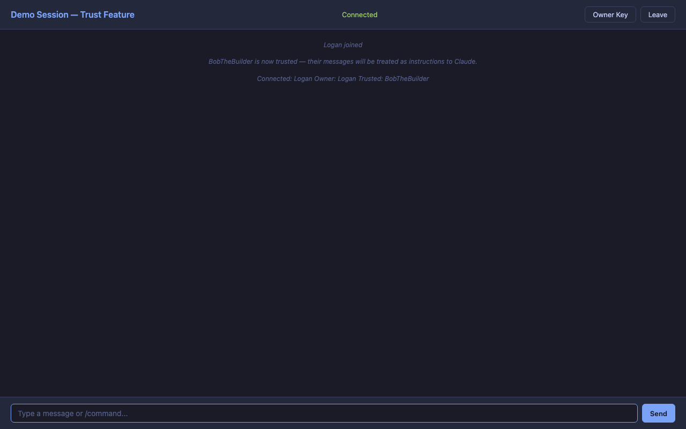
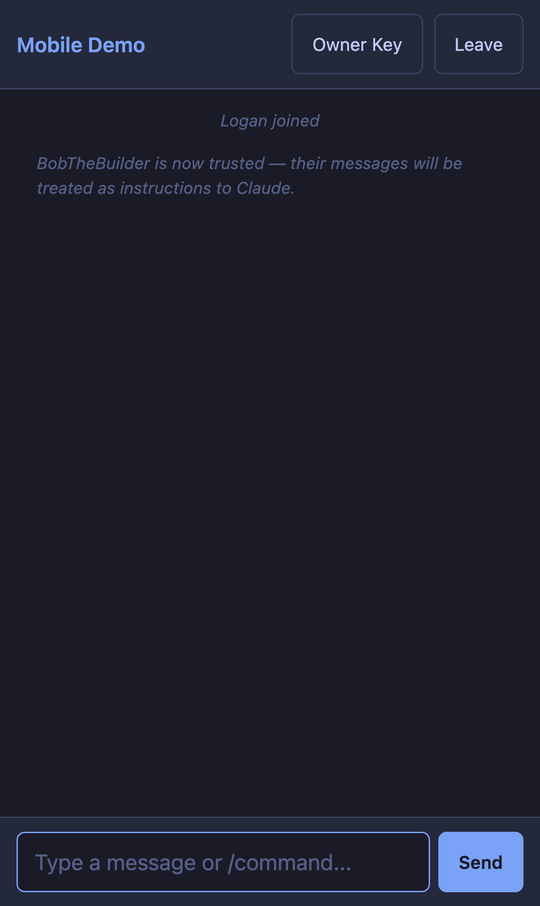
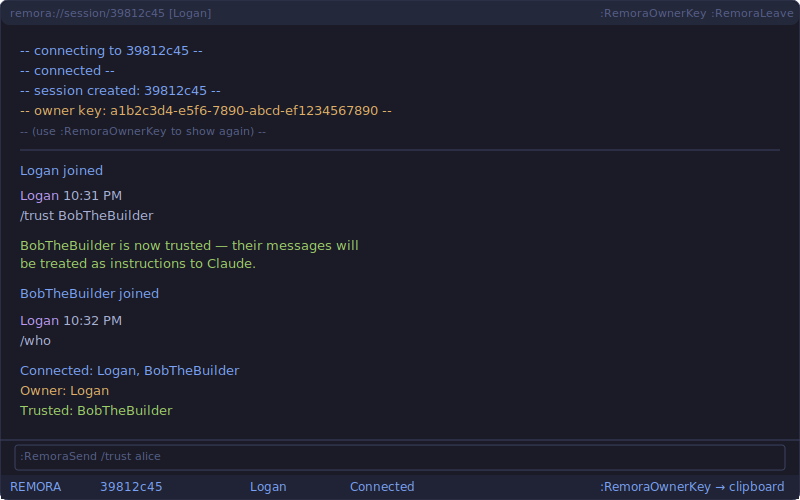
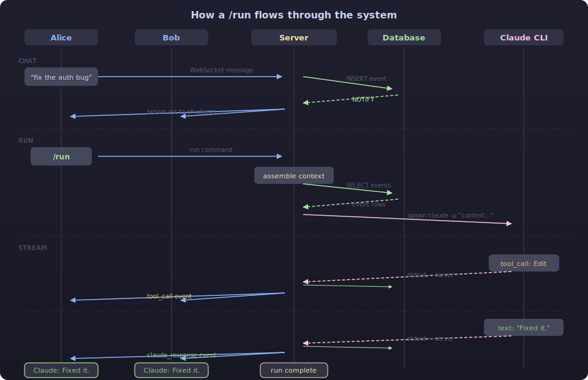

# Remora

[](https://github.com/Logan-Garrett/remora/actions/workflows/ci.yml)
[](https://github.com/Logan-Garrett/remora/releases/latest)
[](https://github.com/Logan-Garrett/remora/stargazers)
[](https://github.com/Logan-Garrett/remora/issues)
[](LICENSE)
[](https://www.rust-lang.org/)
[](#database-support)
[](#database-support)
[](#database-support)

Collaborative Claude Code sessions. Multiple devs share a single session with a shared, append-only event log. Chat freely, add context, and invoke Claude together.

# Why Remora?

The remora is a fish that attaches to larger marine animals — sharks, rays, whales — and travels with them. It doesn't steer, doesn't fight, doesn't change the host. It just rides along, going wherever the bigger animal goes.

This project does the same thing to Claude. It doesn't modify Claude, doesn't replace it, doesn't wrap it in a new model. It just attaches — multiple people at once — and rides along on whatever Claude is doing. The session travels with Claude's context. Everyone sees the same thing. When Claude moves, everyone moves with it.

Multiple remoras can attach to the same host. That's the whole point.

## Screenshots

### Web Client — Login
Connect from any browser. The login page has three tabs: **Token** (team token + display name), **Login** (email + password), and **Register** (create a new account). GitHub and Google OAuth buttons are always visible and open a popup-based flow.



### Web Client — Sessions
Browse, create, and manage sessions. Click to join, or create a new one with optional git repos.



### Web Client — Chat
Real-time event log. Chat with your team, run Claude, and see tool calls and responses as they happen. Session creators see an **Owner Key** button to copy their ownership credential.



### Trust & Ownership
Use `/trust <name>` to mark participants as trusted. Their messages reach Claude as instructions instead of being wrapped in `<untrusted_content>`. Use `/who` to see the owner and trusted list.





### Mobile (iPhone Safari)
The web client is fully responsive. All features including Owner Key and trust commands work on mobile.




### Neovim — Trust & Ownership
Owner key is displayed on session creation and available via `:RemoraOwnerKey`. Use `/trust` and `/untrust` in the chat buffer. Join with an owner key via `:RemoraJoin <url> <session_id> <token> [name] [owner_key]`.



### Neovim — Session Picker (`<space>ms`)
Browse and join sessions with Telescope.


### Neovim — Shared Chat Window
Real-time event log with syntax highlighting. Everyone sees chat, tool calls, and Claude's responses as they happen.


### Neovim — Command Picker (`<space>mc`)
Fuzzy-searchable command palette for all Remora actions.


## How It Works

1. **Create a session** -- one dev creates a session (optionally with git repos cloned in)
2. **Everyone joins** -- teammates connect by session ID via the Telescope picker
3. **Chat and add context** -- send messages, inline files (`/add`), fetch URLs (`/fetch`), view diffs (`/diff`)
4. **Invoke Claude** -- anyone types `/run` and Claude sees all context since the last response
5. **Watch Claude work** -- tool calls, file edits, and responses stream to everyone in real-time
6. **Iterate** -- keep chatting, adding context, and running Claude as a team

Everything is persisted in the database. Reconnect anytime and get the full history. The plugin auto-reconnects up to 3 times on unexpected disconnects.

## Architecture


> See [docs/architecture.md](docs/architecture.md) for a full deep-dive with Mermaid diagrams — database schema, `/run` sequence, WebSocket state machine, and multi-instance deployment.

- **Web Client** -- Static TypeScript/Vite app. Server-agnostic: you enter the server URL, token, and display name at login. One hosted copy of the web client can connect to any Remora server — you don't need to deploy the frontend yourself.
- **Neovim Plugin** -- Lua plugin with Telescope integration. Communicates via a small Rust bridge binary over WebSocket.
- **MCP Server** -- Local TypeScript MCP server. Exposes Remora sessions as tools for Claude Desktop, Claude Code, Cursor, or any MCP-compatible client. Maintains a persistent WebSocket connection.
- **Server** -- Rust (axum). Handles auth, WebSocket connections, event fan-out. Stateless across restarts.
- **Database** -- Postgres (default), SQLite, or MSSQL. Append-only event log, session metadata, allowlists, quotas.
- **Claude CLI** -- Runs on the server host (or inside a Docker sandbox). Streams tool calls and responses as events.
- **Docker Sandbox** -- Optional per-session container isolation. Enabled with `REMORA_USE_SANDBOX=true`.

### Event Flow

How a `/run` flows through the system — from chat to Claude's response, broadcast to all participants.



## Important Notes

- **Security**: By default, Claude runs with `--dangerously-skip-permissions` on the server host. Set `REMORA_SKIP_PERMISSIONS=false` to disable this. Set `REMORA_USE_SANDBOX=true` to run Claude inside an isolated Docker container per session.
- **One run at a time**: Only one Claude run per session. Additional `/run` requests are queued/rejected while one is in flight.
- **Max turns**: Claude runs are capped at 5 agentic turns per invocation (hardcoded).
- **Fetch limits**: `/fetch` truncates responses at 100KB.
- **Idle cleanup**: Sessions idle longer than `REMORA_IDLE_TIMEOUT_SECS` have their workspace deleted and are marked `expired`. Event history is retained in the database. Expired sessions can be resumed via the "Resume" button in the web UI or `POST /sessions/:id/reactivate`. Set `REMORA_IDLE_TIMEOUT_SECS` to a large value (e.g. `999999999`) to effectively disable cleanup.

## Prerequisites

- **Rust** 1.75+ (edition 2021)
- **Database**: Postgres 15+, SQLite 3.35+, or MSSQL 2019+
- **Claude CLI**: installed and authenticated on the server (`npm install -g @anthropic-ai/claude-code && claude login`)
- **git**: on the server (for `/repo add`)
- **curl**: on the client (the Neovim plugin uses it for REST calls)
- **Neovim** 0.9+ with [telescope.nvim](https://github.com/nvim-telescope/telescope.nvim) and [plenary.nvim](https://github.com/nvim-lua/plenary.nvim)

## Setup

### Quick start (interactive)

```bash
git clone https://github.com/Logan-Garrett/remora.git && cd remora
./scripts/setup.sh        # walks you through server + client setup
```

The setup script handles database selection (SQLite by default — no external DB needed), token generation, building, and prints the Neovim config to add.

### Manual setup

### 1. Server

```bash
# -- Postgres setup (skip for SQLite) --
sudo -u postgres psql -c "CREATE USER remora WITH PASSWORD 'your-password';"
sudo -u postgres psql -c "CREATE DATABASE remora OWNER remora;"
# The uuid-ossp extension and all tables are created automatically by migrations.

# -- Configure --
cp .env.example .env
# Edit .env — at minimum set DATABASE_URL and REMORA_TEAM_TOKEN

# -- Build and run --
cargo build --release -p remora-server
source .env && ./target/release/remora-server
# Tables are created automatically on first run via migrations.
```

For **SQLite**, set `REMORA_DB_PROVIDER=sqlite` and `DATABASE_URL=sqlite:remora.db` (or `:memory:` for testing).

#### Server environment variables

| Variable | Default | Description |
|---|---|---|
| `DATABASE_URL` | *required* | Connection string (`postgres://...`, `sqlite:file.db`, or MSSQL) |
| `REMORA_TEAM_TOKEN` | *required* | Shared secret for auth |
| `REMORA_DB_PROVIDER` | `postgres` | Database backend: `postgres`, `sqlite`, or `mssql` |
| `REMORA_BIND` | `0.0.0.0:7200` | Listen address |
| `REMORA_WORKSPACE_DIR` | `/var/lib/remora/workspaces` | Where session repos are cloned |
| `REMORA_RUN_TIMEOUT_SECS` | `600` | Max wall-clock time per Claude run |
| `REMORA_IDLE_TIMEOUT_SECS` | `1800` | Cleanup idle sessions after this many seconds |
| `REMORA_GLOBAL_DAILY_CAP` | `10000000` | Global daily token limit across all sessions |
| `REMORA_CLAUDE_CMD` | `claude` | Path to Claude CLI binary |
| `REMORA_SKIP_PERMISSIONS` | `true` | Pass `--dangerously-skip-permissions` to Claude |
| `REMORA_USE_SANDBOX` | `false` | Run Claude inside a Docker container per session |
| `REMORA_DOCKER_IMAGE` | `ubuntu:22.04` | Docker image for sandbox containers |
| `REMORA_BACKFILL_LIMIT` | `500` | Max events sent to a client on WebSocket connect |
| `REMORA_MAX_SESSIONS` | `100` | Max concurrent sessions (returns 429 when reached) |
| `REMORA_JWT_SECRET` | auto-generated | Secret for signing JWTs. Auto-generates if unset, but tokens won't survive restarts. Set this for production. |
| `REMORA_JWT_EXPIRY_SECS` | `3600` | JWT access token lifetime (1 hour) |
| `REMORA_REFRESH_EXPIRY_SECS` | `604800` | Refresh token lifetime (7 days) |
| `REMORA_OAUTH_GITHUB_CLIENT_ID` | | GitHub OAuth app client ID (optional, enables GitHub login) |
| `REMORA_OAUTH_GITHUB_CLIENT_SECRET` | | GitHub OAuth app client secret |
| `REMORA_OAUTH_GOOGLE_CLIENT_ID` | | Google OAuth client ID (optional, enables Google login) |
| `REMORA_OAUTH_GOOGLE_CLIENT_SECRET` | | Google OAuth client secret |
| `REMORA_OAUTH_REDIRECT_URL` | | Base URL for OAuth callbacks (e.g. `https://your-server.com`) |

### 2. Client (Neovim)

Build the bridge binary for your platform:

```bash
cargo build --release -p remora-bridge
```

Add to your Neovim config (lazy.nvim):

```lua
{
  "Logan-Garrett/remora",
  dependencies = {
    "nvim-telescope/telescope.nvim",
    "nvim-lua/plenary.nvim",
  },
  config = function()
    require("remora").setup({
      bridge = vim.fn.expand("path/to/remora-bridge"),
      -- These fall back to env vars: REMORA_URL, REMORA_TEAM_TOKEN, REMORA_NAME
      url = "http://your-server:7200",
      token = "your-team-token",
      name = "yourname",
    })
    require("telescope").load_extension("remora")
  end,
}
```

#### Plugin setup options

| Option | Default | Description |
|---|---|---|
| `bridge` | `"remora-bridge"` | Path to the bridge binary |
| `url` | `"http://localhost:7200"` | Server URL |
| `token` | `$REMORA_TEAM_TOKEN` or `""` | Team token (falls back to env var) |
| `name` | `vim.fn.hostname()` | Your display name |

### 3. Web Client

The web client is a static site — it has no opinion about which server it connects to. The server URL, team token, and display name are entered at login time and stored in `sessionStorage` for the browser session.

**You do not need to host the web client yourself.** You can use any publicly deployed copy of the web client and point it at your own server. Conversely, one hosted copy of the web client can be shared across multiple teams running different servers.

To build and serve it yourself:

```bash
cd web && npm install && npm run build
# Serve the dist/ folder with any static file server
python3 -m http.server 3000 --directory dist/
# or: nginx, caddy, serve, etc.
```

Open it in a browser and enter your server URL (e.g. `http://your-server:7200`). Choose the **Token** tab for a shared team token, the **Login** tab for an email/password account, the **Register** tab to create a new account, or click **Continue with GitHub** / **Continue with Google** to sign in via OAuth.

### 4. MCP Server (Claude Desktop, Claude Code, Cursor)

The MCP server lets any MCP-compatible AI client interact with Remora sessions — persistent WebSocket connection, real-time event buffering, no reconnection per command.

```bash
cd mcp && npm install && npm run build
```

Add to your MCP client config (e.g. `~/.claude/settings.json` for Claude Code):

```json
{
  "mcpServers": {
    "remora": {
      "command": "node",
      "args": ["/path/to/remora/mcp/dist/index.js"],
      "env": {
        "REMORA_URL": "http://your-server:7200",
        "REMORA_TEAM_TOKEN": "your-team-token",
        "REMORA_NAME": "Claude-MCP"
      }
    }
  }
}
```

Tools exposed: `remora_health`, `remora_sessions`, `remora_create`, `remora_join`, `remora_send`, `remora_run`, `remora_events`, `remora_leave`, `remora_delete`.

### 5. Cross-compile for ARM Linux (Raspberry Pi, etc.)

```bash
rustup target add aarch64-unknown-linux-gnu
cargo install cargo-zigbuild
cargo zigbuild --release --target aarch64-unknown-linux-gnu -p remora-server
scp target/aarch64-unknown-linux-gnu/release/remora-server user@host:~/remora/
```

## Usage

### Suggested keybindings

The plugin registers commands but not keybindings. Add these to your config:

```lua
vim.keymap.set("n", "<leader>mm", function() require("remora").toggle() end, { desc = "Toggle Remora" })
vim.keymap.set("n", "<leader>ms", "<CMD>Telescope remora sessions<CR>", { desc = "Browse sessions" })
vim.keymap.set("n", "<leader>mc", "<CMD>Telescope remora commands<CR>", { desc = "Remora commands" })
vim.keymap.set("n", "<leader>mn", "<CMD>Telescope remora new<CR>", { desc = "New session" })
vim.keymap.set("n", "<leader>mr", function() require("remora").send_command("/run") end, { desc = "Run Claude" })
vim.keymap.set("n", "<leader>ml", "<CMD>RemoraLeave<CR>", { desc = "Leave session" })
```

### Prompt buffer controls

| Key | Action |
|---|---|
| `<CR>` | Send message (or execute slash command) |
| `<S-CR>` | Insert newline |
| `<Esc>` / `q` | Close the Remora window (stays connected) |
| `G` (in log) | Re-enable auto-scroll after scrolling up |

### Slash commands (type in the prompt buffer)

| Command | Description |
|---|---|
| `/run` | Invoke Claude with context since last response |
| `/run-all` | Invoke Claude with the full event log |
| `/clear` | Reset context baseline |
| `/diff` | Git diff across all repos |
| `/add <path>` | Inline a file as context |
| `/fetch <url>` | Fetch and inline URL content |
| `/who` | List connected participants |
| `/session info` | Current session metadata |
| `/session new <git-url> [<git-url>...] "<desc>"` | Create a new session |
| `/repo list` | List repos in session |
| `/repo add <url>` | Clone a repo into the workspace |
| `/repo remove <name>` | Remove a repo |
| `/allowlist` | Show fetch domain allowlist |
| `/allowlist add <domain>` | Pre-approve a domain |
| `/allowlist remove <domain>` | Remove a domain from allowlist |
| `/approve <domain>` | Approve a pending fetch |
| `/deny <domain>` | Deny a pending fetch |
| `/trust <name>` | Mark a participant as trusted (owner only) |
| `/untrust <name>` | Remove trust from a participant (owner only) |
| `/kick <name>` | Remove a participant |
| `/join <id>` | Switch to another session |
| `/sessions` | List all sessions |
| `/help` | Show command list |

### REST API

#### Sessions

| Method | Path | Description |
|---|---|---|
| `POST` | `/sessions` | Create session `{description, repos: [url]}` -- response includes `owner_key` |
| `GET` | `/sessions` | List sessions (includes `status`: "active" or "expired") |
| `DELETE` | `/sessions/:id` | Delete session + cleanup (owner or admin only) |
| `POST` | `/sessions/:id/reactivate` | Resume an expired session |
| `GET` | `/sessions/:id` | WebSocket upgrade (query: `token`, `name`, optional `owner_key`) |

#### Session Invite Tokens

| Method | Path | Description |
|---|---|---|
| `POST` | `/sessions/:id/tokens` | Create an invite token for a session |
| `GET` | `/sessions/:id/tokens` | List tokens for a session |
| `DELETE` | `/sessions/:id/tokens/:token_id` | Revoke a session token |

#### Auth (User Accounts)

| Method | Path | Description |
|---|---|---|
| `POST` | `/auth/register` | Create a user account (email + password, argon2 hashed) |
| `POST` | `/auth/login` | Login, returns JWT access + refresh tokens |
| `POST` | `/auth/refresh` | Rotate refresh token, get new access token |
| `GET` | `/auth/me` | Current user info (requires JWT or API key) |
| `POST` | `/auth/api-keys` | Create a per-user API key (`rmk_` prefix, SHA-256 hashed at rest) |
| `GET` | `/auth/api-keys` | List API keys |
| `DELETE` | `/auth/api-keys/:id` | Revoke an API key |
| `GET` | `/auth/oauth/github` | Redirect to GitHub for OAuth login (accepts `?origin=` for popup flow) |
| `GET` | `/auth/oauth/github/callback` | GitHub OAuth callback — returns JWT JSON, or HTML+postMessage when `origin` is set |
| `GET` | `/auth/oauth/google` | Redirect to Google for OAuth login (accepts `?origin=` for popup flow) |
| `GET` | `/auth/oauth/google/callback` | Google OAuth callback — returns JWT JSON, or HTML+postMessage when `origin` is set |

#### OAuth Flow

**Browser popup flow (web client):**

1. Web client opens `GET /auth/oauth/github?origin=<web-client-origin>` in a popup window
2. Server encodes the origin into the HMAC-signed CSRF `state` parameter (self-validating, no server-side storage)
3. User authorizes on the provider's consent screen
4. Server exchanges the code, creates or links the user account, and returns an HTML page
5. The HTML page calls `window.opener.postMessage(authData, origin)` and closes the popup
6. Web client receives the JWT via `message` event (origin-validated), stores it, and proceeds

**Non-browser flow (CLI, integrations):**

Omit the `origin` query parameter. The callback returns a JSON `AuthResponse` directly (or redirects to `REMORA_OAUTH_REDIRECT_URL` with the JWT as a query parameter if that env var is set).

Requires `REMORA_OAUTH_GITHUB_CLIENT_ID`/`SECRET` or `REMORA_OAUTH_GOOGLE_CLIENT_ID`/`SECRET` to be configured. OAuth is optional; the server works fine without it.

#### Token Resolution

All endpoints require `Authorization: Bearer <token>` header (or `token` query param for WS). REST endpoints accept any of these credential types; the server resolves them in priority order:

1. **Admin team token** (`REMORA_TEAM_TOKEN`) -- full server access
2. **JWT access token** -- issued via `/auth/login` or OAuth callback
3. **Per-user API key** -- `rmk_`-prefixed, for programmatic/CI access
4. **Session invite token** -- scoped to a single session

The `owner_key` returned by `POST /sessions` is a secret UUID that proves session ownership. Pass it as `owner_key=<key>` in the WebSocket query params to claim ownership (required for `/trust` and `/untrust` commands). Without it, the first participant to join becomes owner.

## Database Support

| Backend | Provider value | Notifications | Notes |
|---|---|---|---|
| Postgres | `postgres` | LISTEN/NOTIFY | Recommended for multi-instance deployments |
| SQLite | `sqlite` | In-process broadcast | Single instance only, great for local dev |
| MSSQL | `mssql` | In-process broadcast | Requires `--features mssql` at build time |

## Security

### Authentication

Remora supports two auth modes that can be used together:

**Legacy mode (team token):** A single shared `REMORA_TEAM_TOKEN` grants full server access. This is how the Neovim plugin authenticates by default. Simple to set up, appropriate for small trusted teams.

**User accounts:** Email/password registration with argon2 hashing, JWT access/refresh tokens, GitHub and Google OAuth 2.0, and per-user API keys. Supported by both the REST API and the web client login page (Token, Login, Register tabs, plus GitHub/Google OAuth buttons).

### Roles (RBAC)

Users are assigned one of four roles. The admin team token implicitly has `admin` level access.

| Role | Level | Permissions |
|---|---|---|
| `admin` | 4 | Full access, manage users and sessions |
| `member` | 3 | Create sessions, join sessions, run Claude (default for new accounts) |
| `viewer` | 2 | Join sessions, read events (cannot run Claude or modify sessions) |
| `guest` | 1 | Read-only access to sessions they are invited to |

Role enforcement applies to JWT and API key authentication. The legacy team token bypasses RBAC (treated as admin).

### Known limitations

- **WebSocket token in query string**: The token is passed as a query parameter during the WebSocket upgrade (`?token=...`). This is standard practice for WebSocket auth (the `Authorization` header is not available during browser-initiated upgrades), but it means the token may appear in reverse proxy access logs. Configure your reverse proxy to strip query strings from logs, or use a short-lived token exchange if this is a concern.

### Trust model

By default, all chat messages are untrusted and wrapped in `<untrusted_content>` tags when sent to Claude. The session owner (the first participant to join) can run `/trust <name>` to mark a participant as trusted, allowing their messages to reach Claude as plain instructions. Display names are unique per session -- duplicate names are rejected at connect time. See [SECURITY.md](SECURITY.md) for details and known limitations.

## Roadmap

See [ROADMAP.md](ROADMAP.md) for the full plan. Short version:

- **RBAC enforcement** -- wire role checks into WebSocket command dispatch (helpers exist, not yet active)
- **Multi-tenancy** -- team namespacing so multiple groups can share one server
- **MySQL / MariaDB** -- fourth database backend
- **Admin dashboard** -- surface the token usage, run analytics, and allowlists already tracked in the DB
- **Desktop app** -- native Tauri wrapper with menu-bar presence and notifications (shell exists, features in progress)
- **VS Code / JetBrains plugins** -- bring the Neovim plugin experience to other editors

## Contributing

PRs are welcome. See [ROADMAP.md](ROADMAP.md) for areas that need help.

Fork, branch, PR. No special process -- just keep it clean and explain what you changed.

## License

Source Available — free for personal, internal, and non-commercial open-source use. Commercial distribution or use in a paid product requires a written agreement with the copyright holder. See [LICENSE](LICENSE) for full terms.
