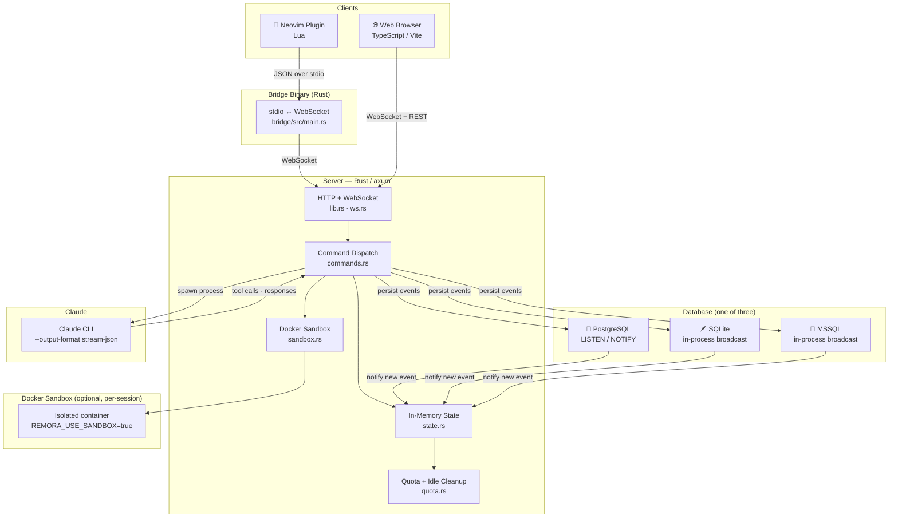
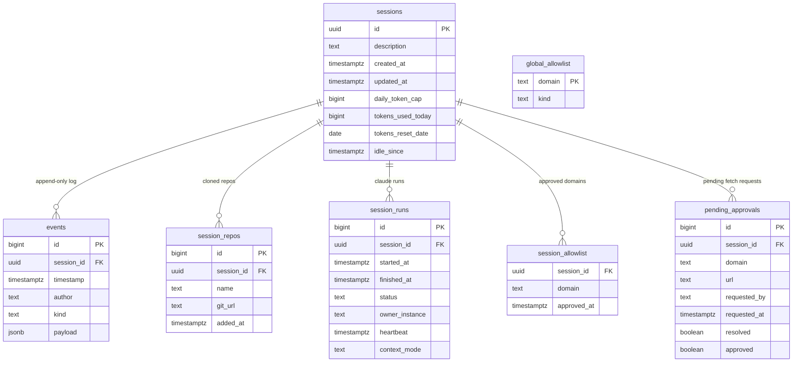
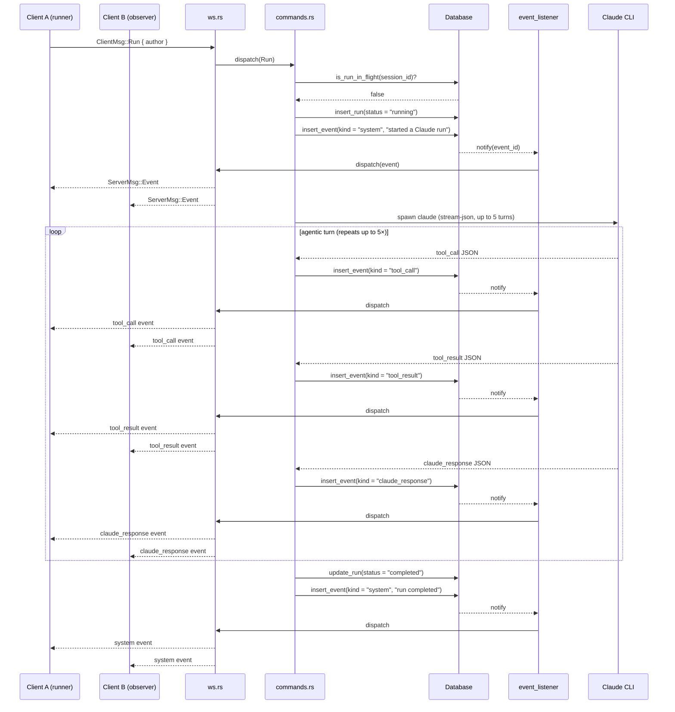
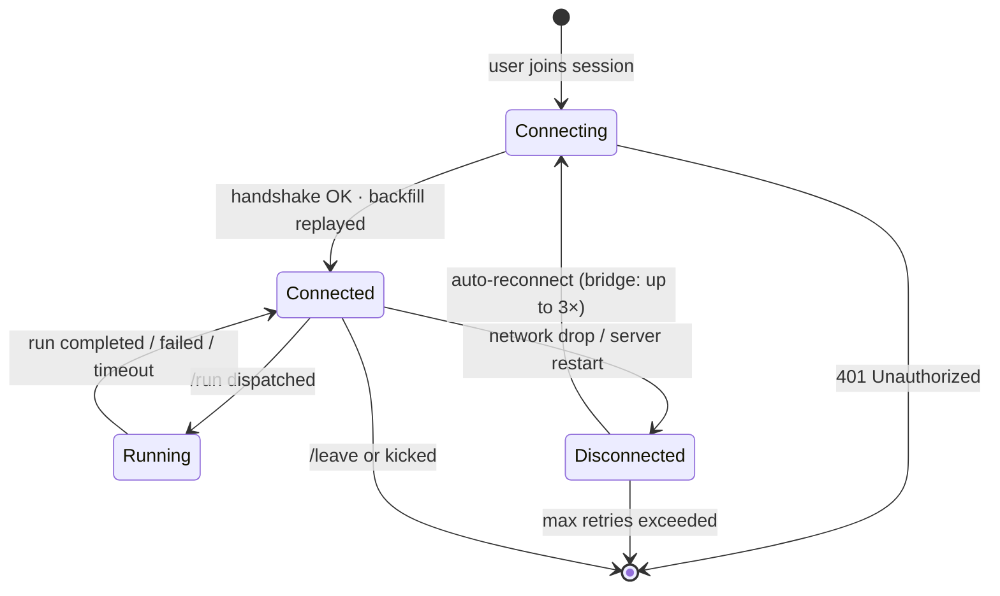
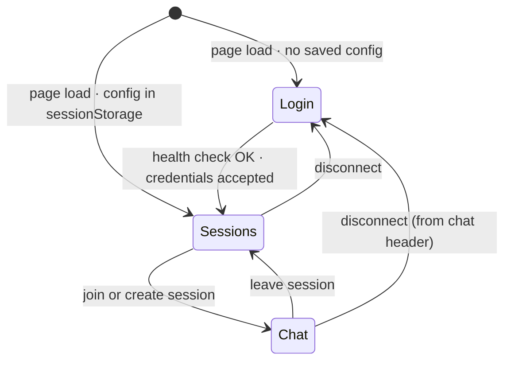

# Remora — Architecture

A deep-dive reference for contributors and operators. See [README.md](../README.md) for a quick overview.

---

## System Components

---

## Database Schema

### Event `kind` values

| kind | Emitted by | Description |
|---|---|---|
| `chat` | any client | Plain chat message |
| `system` | server | Join/leave/info/help/error messages |
| `claude_response` | Claude CLI | A full response turn from Claude |
| `tool_call` | Claude CLI | A tool invocation (file edit, bash, etc.) |
| `tool_result` | Claude CLI | Output from a tool call |
| `file` | `/add` command | Inlined file content |
| `diff` | `/diff` command | Git diff output |
| `fetch` | `/fetch` command | Fetched URL content |
| `clear_marker` | `/clear` command | Context reset point |
| `kick` | `/kick` command | Participant removal notice |

---

## `/run` Sequence

How a Claude run flows from the moment a user types `/run` to every participant seeing the response.

---

## WebSocket Connection Lifecycle

Notes:
- The server sends a **30-second WebSocket ping** to prevent Cloudflare and other proxies from closing idle connections.
- On reconnect, the server replays up to `REMORA_BACKFILL_LIMIT` (default 500) recent events so the client catches up.
- The bridge binary handles reconnect logic. The web client does not auto-reconnect — the user re-opens or refreshes.

---

## Web Client Navigation

The web client stores `{ url, token, name }` in `sessionStorage` after a successful login. Refreshing the page skips the login screen. Clicking **Disconnect** clears it and returns to login.

---

## Multi-Instance Deployment

```mermaid
flowchart LR
    subgraph lb ["Load Balancer / Tunnel"]
        LB["nginx · Cloudflare · etc."]
    end

    subgraph instances ["Server Instances"]
        S1["remora-server :7200"]
        S2["remora-server :7201"]
    end

    subgraph state ["Shared State"]
        PG["PostgreSQL\nLISTEN / NOTIFY"]
        FS["Shared Filesystem\nor object store"]
    end

    LB --> S1 & S2
    S1 & S2 --> PG
    S1 & S2 --> FS

    style lb fill:#2f3350,stroke:#7aa2f7
    style state fill:#2f3350,stroke:#9ece6a
```

**Works today with Postgres.** LISTEN/NOTIFY crosses process boundaries — when instance S1 writes an event, S2 gets the notification and fans it out to its own subscribers.

**Does not work with SQLite or MSSQL** — their notification path is in-process only.

**Remaining gap:** the `participants` map (who is online) is still per-instance. `/who` only shows users connected to the same instance. Moving presence to the DB is on the roadmap.

---

## Notification Backends

| Backend | Notification mechanism | Multi-instance safe |
|---|---|---|
| PostgreSQL | `pg_notify` + `LISTEN` | ✅ Yes |
| SQLite | `tokio::sync::broadcast` | ❌ Single instance only |
| MSSQL | `tokio::sync::broadcast` | ❌ Single instance only |
